# Lumber — Customer Success Project

> Source: [Lumber](https://www.notion.so/28c1d464528f801bac72d6c064d30db2)
> Sub-pages:
> - [Workforce Junction](https://www.notion.so/2f71d464528f80428a68dd67e47451a0)
> - [Workforce Junction - Schema for MDV](https://www.notion.so/28e1d464528f80238c9cc5eced5161fc)
> - [Schema of Lumber Postgres](https://www.notion.so/2f71d464528f8092b0dce634ef55bfb7)
> - [Job Costing Report](https://www.notion.so/2fb1d464528f808b987cce2583b7fb8a)
> - [Payroll reporting](https://www.notion.so/3041d464528f80c4bc54c355306a4129)
> - [Payroll tables documentation](https://www.notion.so/3041d464528f8000b005f648dcf2bef6)
> - [Payroll reports](https://www.notion.so/3041d464528f80ae954cc7968a6373fd)
> - [New schema](https://www.notion.so/32f1d464528f807295d8ee25ae47852c)
> - [CTE vs substitution variables](https://www.notion.so/32f1d464528f80f0ba2cdd94c7d3f3d2)
> - [Report Builder](https://www.notion.so/3351d464528f800d8b5ce12f6517c93f)
> - [Claude Code generated assets](https://www.notion.so/3371d464528f809c9c5ed929c8709ecd)

---

## Workspace

- **Workspace ID:** `iaEj4QYboi`
- **Snowflake project:** `https://remix-dev.remixlabs.com/e/edit/snowflake`
- **Lumber reporting:** `https://remix-india.remixlabs.com/e/edit/lumber_reporting`
- **Web catalog:** `remix.app/run?_rmx_url=https://agt.files.remix.app/iaEj4QYboi/_rmx_files/apps/catalog.remix`
- **Table configurator:** `https://agt.files.remix.app/iaEj4QYboi/_rmx_files/apps/component_table.remix`
- **Pull plugin repos:** "Table Builder" and "Facet Builder" (clone head revision, then Rebuild & Publish)

---

## Two Database Domains

### 1. Job Costing Schema (PostgreSQL — `lfi_` prefix)

6 core tables for construction job costing:

| Table                               | Purpose                                                  |
|-------------------------------------|----------------------------------------------------------|
| `lfi_company`                       | Master company/org data (74 sample rows)                 |
| `lfi_project`                       | Job sites/work assignments per company                   |
| `lfi_cost_code_hierarchical`        | Hierarchical cost codes (parent/child)                   |
| `lfi_project_cost_code_association` | Links projects to cost codes with estimated hours        |
| `lfi_timesheet`                     | Worker clock in/out entries by project + cost code       |
| `lfi_worker_compensation_detail`    | Computed pay from timesheets (REG/OT/DOT rates + travel) |

**Data flow:** company → project → timesheet → worker_compensation_detail, with cost codes categorizing work.

**Key function:** `fnc_cost_code_report_for_all_projects(p_company_id, p_start_date, p_end_date)` — aggregates across all projects, returns one row per cost code with period actuals + all-time totals.

### 2. Workforce Junction Schema (SQL Server — `h_` prefix)

Employee benefits management system for MDV. Core tables:

| Table                                       | Purpose                                          |
|---------------------------------------------|--------------------------------------------------|
| `h_employee_personalInfo`                   | PK: (CompanyId, PersonId). Full employee details |
| `h_dependent_personalInfo`                  | Employee dependents                              |
| `h_employeeInvalidEnrollmentInfo`           | Benefits enrollment records                      |
| `h_dependent_enrollment_info`               | Dependent enrollment                             |
| `h_Documents` / `h_EmployeeEnrollDocuments` | Document storage + enrollment docs               |
| `h_EmployeeEmergencyContacts`               | Emergency contacts                               |
| `H_EmployeeSettings`                        | Notification preferences                         |

> Full DDL: fetch from [Workforce Junction - Schema for MDV](https://www.notion.so/28e1d464528f80238c9cc5eced5161fc)

---

## Payroll Schema (PostgreSQL — `prl_` prefix)

38 tables in three groups:

| Group                  | Tables | Purpose                                                             |
|------------------------|--------|---------------------------------------------------------------------|
| **Payroll Processing** | 16     | Payroll runs, employee items, earnings, benefits, taxes, deductions |
| **Journal Entries**    | 14     | Accounting journals at company + employee level                     |
| **Chart of Accounts**  | 8      | GL accounts, classes, groups, mappings                              |

### Key Tables

- `prl_payroll` — Central payroll run (type: REGULAR/OFF_CYCLE, status: DRAFT/APPROVED/PAID)
- `prl_payroll_employee_item` — One per employee per payroll, links to line items
- `prl_payroll_employee_earning` — Earnings by type (REGULAR/OVERTIME/DOUBLE_OVERTIME) with project + cost code
- `prl_payroll_totals` — Aggregate payroll totals (gross, net, benefits, taxes, cash requirement)
- `prl_journal` — One journal per payroll, with company-level and employee-level breakdowns

### Data Flow

```
lfi_timesheet → prl_payroll_timesheet_map → prl_payroll
  → prl_payroll_employee_item
    → earnings / benefits / taxes / deductions / reimbursements
  → prl_payroll_totals
  → prl_journal → journal line items (company + employee level)
    → prl_chart_of_account_mapping → prl_chart_of_account
```

> Full table docs: fetch from [Payroll tables documentation](https://www.notion.so/3041d464528f8000b005f648dcf2bef6)

---

## Payroll Report Functions (50+)

Organized into groups. All return TABLE types (parameterized views):

| Group              | Count | Key functions                                                                            |
|--------------------|-------|------------------------------------------------------------------------------------------|
| Payroll Processing | 17    | `fnc_company_payrolls`, `fnc_timesheets_for_payroll`, `fnc_worker_pay_rates_for_payroll` |
| Journal/Accounting | 8     | `fnc_payroll_totals_comparison`, `fnc_payroll_discrepancies`                             |
| Benefits           | 12    | Lookups, proportionation (by time spent), expiration alerts                              |
| Earnings           | 7     | Lookups, proportionation                                                                 |
| Taxes              | 5     | Lookups per company/payroll                                                              |
| Reimbursements     | 12    | Lookups, proportionation, expiration                                                     |
| Cost Code Reports  | 5     | Non-payroll job costing from timesheets directly                                         |

### Key Concepts

- **Proportionation** — Flat-rate items (benefits, earnings, reimbursements) allocated across timesheets for job costing. Three strategies: default (by gross earnings), by time spent, PDM (migration).
- **Journal reconciliation** — Payroll vs journal comparison functions detect discrepancies.
- **Row-level security** — `p_auth_user_*` params on cost code reports.

### Naming Conventions

`_by_payroll` = specific run, `_ext` = with payroll IDs, `_new` = as-of payday, `_in_period` = date range, `_by_time_spent` = proportionation, `_non_payroll` = uses timesheets directly, `_comparison`/
`_discrepancies` = audit

### Snowflake Migration Notes

- Parameterized functions → Views + GETVARIABLE() or materialized tables with CTE params
- Proportionation → Snowflake UDFs or pre-compute during load
- Row-level security → Row access policies or secure views

> Full function reference: fetch from [Payroll reports](https://www.notion.so/3041d464528f80ae954cc7968a6373fd)

---

## Job Costing Report

Input: `p_company_id`, `p_start_date`, `p_end_date`
Output: one row per cost code

**Report columns:** Cost Code, Description, then REG/OT/DOT breakdowns for:

- Actual Labor Hours (period)
- Actual Labor Cost (period)
- Total Hours To Date (all-time)
- Total Cost To Date (all-time)

Plus hidden columns: combined totals, travel, estimated hours (budget).

**Filters:** Excludes REJECTED, CLOCKED_IN timesheets and PAID_HOLIDAY type.

> Full mapping: fetch from [Job Costing Report](https://www.notion.so/2fb1d464528f808b987cce2583b7fb8a)

---

## Reporting Requirements (from Oleg document)

> Source: [Lumber](https://www.notion.so/28c1d464528f801bac72d6c064d30db2) — updated 2026-03-17

**Overall goals:**

- Self-service reporting infrastructure for internal teams: build, customize, filter, export, save own report views
- Same capability extended to customers (Phase 4)

| Requirement                 | Detail                                                                                      | Priority    |
|-----------------------------|---------------------------------------------------------------------------------------------|-------------|
| Report Builder              | Select data sources, choose columns, apply filters, save custom report templates            | Must Have   |
| Interactive Data Grid       | Sortable, resizable, searchable columns; pinned rows/columns; grouped headers; paginated    | Must Have   |
| Excel & CSV Export          | One-click download of current report view (.xlsx + .csv), respecting active filters         | Must Have   |
| Search & Filters            | Real-time text search across all columns; date range pickers; dropdown/multi-select filters | Must Have   |
| Charts & Visualizations     | Bar charts, grouped/stacked series; charts linked to grid data and update with filters      | Should Have |
| Saved Views                 | Save report configs (filters, columns, sort) as named views; share with team                | Should Have |
| Design consistency          | Consistent with rest of Lumber UI                                                           | —           |
| Report lifecycle management | Develop + test (preview), then package + publish reports to production                      | Must Have   |

### Delivery Timeline

| Phase   | Scope                                                                                                                                      |
|---------|--------------------------------------------------------------------------------------------------------------------------------------------|
| Phase 1 | Remix Desktop on Mac; Lumber workspace on Remix-hosted agent server; Remix-provided Snowflake account; PostgreSQL one-off refresh (manual) |
| Phase 2 | TBD                                                                                                                                        |
| Phase 3 | TBD                                                                                                                                        |
| Phase 4 | Customer self-service for reporting                                                                                                        |

---

## Report Builder — Proposed Node Model

> Source: [Report Builder](https://www.notion.so/3351d464528f800d8b5ce12f6517c93f) — updated 2026-04-03

### Problem Statement (4 issues with current implementation)

1. Cannot handle multi-source reports (e.g. job costing) where different data sources share common facets but have different SQL outputs
2. Each report element runs SQL independently — inefficient
3. "Simplicity" creates opacity; a cleaner node graph with clear functional definitions and visible data edges is better
4. Current model lacks expressive power for facet-driven multi-element reports and trigger-based refresh

### Thesis: Report Node Types

| Node Type             | Role                                                                                               |
|-----------------------|----------------------------------------------------------------------------------------------------|
| **Facet nodes**       | UI controls (dropdown, date range, etc.) — each produces a filter fragment                         |
| **Facet Aggregator**  | Combines all facets into a CTE WHERE clause; one aggregator per set of co-faceted data             |
| **Data Fetch nodes**  | Source: Snowflake view; assembles CTE + SELECT + Sort + Pagination; outputs result set             |
| **Display nodes**     | Table, Bar Chart, Bubble Chart, etc. — consume result sets from Data Fetch nodes                   |
| **Sort / Pagination** | Modifier nodes driven by user interaction on Table display; feed back into Data Fetch for re-query |

### Node Graph Pattern

```
Facet 1 → Facet Aggregator → Data Fetch 1 → Display: Table  ←→ Sort/Pagination
Facet 2 ↗                 ↘ Data Fetch 2 → Display: Bar Chart
Facet N ↗                              ↘ Display: Bubble Chart
```

- Multiple facets feed one aggregator
- One aggregator can drive multiple Data Fetch nodes (different views, same WHERE clause)
- Multiple Display nodes can consume the same Data Fetch result
- Table display nodes have `sort` and `pagination` out-bindings that re-trigger Data Fetch

### Applied to Job Costing Report

| Node                     | Detail                                                                      |
|--------------------------|-----------------------------------------------------------------------------|
| Facet: Project           | All Projects or single; filters `dim_project_key`                           |
| Facet: Date Range        | `start_date`, `end_date`; filters `date_worked`                             |
| Facet Aggregator         | `WHERE dim_project_key = N AND date_worked BETWEEN start AND end`           |
| Data Fetch: Table        | Source: `V_JOB_COSTING_TABLE`; groups by `cost_code`; 14 output columns     |
| Data Fetch: Chart        | Source: `V_JOB_COSTING_CHART`; groups by `date_worked`; 7 columns           |
| Display: Table           | 14 cols, grouped headers (REG/OT/DOT), totals row; drives Sort + Pagination |
| Display: Hours Bar Chart | X = date, Y = stacked reg/ot/dot hours                                      |
| Display: Cost Bar Chart  | X = date, Y = stacked reg/ot/dot costs                                      |

### 5 Reports Defined in This Model

| Report                 | Snowflake View(s)                | Key Grouping          |
|------------------------|----------------------------------|-----------------------|
| Job Costing            | `V_JOB_COSTING_TABLE` + `_CHART` | cost_code / date      |
| Payroll Journal        | `V_PAYROLL_JOURNAL_*`            | payroll run / journal |
| Payroll Summary        | `V_PAYROLL_SUMMARY_*`            | payroll totals        |
| Project Labor Overview | `V_PROJECT_LABOR_OVERVIEW_*`     | project / date        |
| Worker Compensation    | `V_WORKER_COMPENSATION_*`        | worker / cost code    |

Report definitions stored as JSON (node-graph isomorphic with Remix node graph): `job_costing.json`, `payroll_journal.json`, `payroll_summary.json`, `project_labor_overview.json`,
`worker_compensation.json`.

---

## Snowflake Star Schema (LUMBER_FI database)

> Source: [Claude Code generated assets](https://www.notion.so/3371d464528f809c9c5ed929c8709ecd) — updated 2026-04-03
> Snowflake account: `OXFSVKI-TW30727` → database: `LUMBER_FI` → schema: `PUBLIC`

### Schema Design

**Source:** PostgreSQL reporting tables (refreshed every 10 min from core PostgreSQL tables)
**Target:** Snowflake star schema — `DIM_*` dimension tables + `FACT_*` fact tables

PostgreSQL → Snowflake ETL is one-off for Phase 1. Dummy data loaded via Claude Code-generated Python script.

### SQL Views for Reports

| File                                     | View / Purpose                                |
|------------------------------------------|-----------------------------------------------|
| `3_create_job_costing_views.sql`         | `V_JOB_COSTING_TABLE` + `V_JOB_COSTING_CHART` |
| `4_create_project_labor_overview_views`  | `V_PROJECT_LABOR_OVERVIEW_*`                  |
| `7_create_payroll_journal_views.sql`     | `V_PAYROLL_JOURNAL_*`                         |
| `8_create_payroll_summary_views.sql`     | `V_PAYROLL_SUMMARY_*`                         |
| `9_create_worker_compensation_views.sql` | `V_WORKER_COMPENSATION_*`                     |

### Snowflake Credentials (dev environment)

```
SNOWFLAKE_ACCOUNT=OXFSVKI-TW30727
SNOWFLAKE_USER=<rmohsin or vchakrav>
SNOWFLAKE_PASSWORD=<password>
SNOWFLAKE_WAREHOUSE=COMPUTE_WH
SNOWFLAKE_DATABASE=LUMBER_FI
SNOWFLAKE_SCHEMA=PUBLIC
```

### Claude Code Workflow (used to bootstrap schema)

1. PostgreSQL reporting schema from Lumber (`004051-*` + `004052-*` SQL files)
2. Claude generates Snowflake star schema (`1_create_snowflake_tables.sql`)
3. Claude generates dummy data (`generate_dummy_data.py` → `2_load_dummy_data.sql`)
4. Claude generates SQL views per report type (files `3_` through `9_`)
5. Claude generates JSON report node-graph definitions (5 JSON files)
6. Python report renderer (`main.py` + `requirements.txt`) reads JSON, connects to Snowflake, renders with live facets

Session context file for Claude Code: `remix-cte-report-building.md` (attached to Notion page — pass to Claude Code to restore session context).

**Renderer directory structure:**

```
rpt_dir/
  .env
  main.py
  requirements.txt
  reports/
    job_costing.json
    payroll_journal.json
    payroll_summary.json
    project_labor_overview.json
    worker_compensation.json
```

---

## CTE Limitation Analysis

> Source: [CTE vs substitution variables](https://www.notion.so/32f1d464528f80f0ba2cdd94c7d3f3d2) — updated 2026-03-26

**Conclusion: Some reports cannot be built with the CTE pattern.**

### The Problem (Job Costing Report)

The job costing report has two kinds of aggregates in the same result row:

- **Actuals** — hours and costs filtered by the selected project + date range
- **Totals to date** — cumulative hours and costs across **all time** (unfiltered)

Because both are GROUP BY aggregations (not raw rows), a single SQL query using CTEs cannot serve both simultaneously. The CTE WHERE clause would filter the unfiltered totals, breaking them.

The only SQL that can produce the complete report requires `start_date` and `end_date` **inside the SQL itself**, not injected via a CTE prefix:

```sql
-- S1: actuals only — works with CTE pattern (filtered data)
SELECT cost_code
     , cost_code_description
     , ROUND(SUM(regular_hours), 2)         AS actual_regular_hours
     , ROUND(SUM(overtime_hours), 2)        AS actual_overtime_hours
     , ROUND(SUM(double_overtime_hours), 2) AS actual_double_overtime_hours
     , ROUND(SUM(regular_cost), 2)          AS actual_regular_cost
     , ROUND(SUM(overtime_cost), 2)         AS actual_overtime_cost
     , ROUND(SUM(double_overtime_cost), 2)  AS actual_double_overtime_cost
FROM v_job_costing_detail
GROUP BY cost_code, cost_code_description
ORDER BY cost_code
```

The "totals to date" columns require a separate query against unfiltered data → they cannot coexist with the actuals in a single CTE-parameterized query.

### Implication for Report Builder Design

This is the direct motivation for the Report Builder node model (separate Data Fetch nodes per view/SQL), rather than a single CTE-parameterized report element. Each Data Fetch node queries its own
Snowflake view independently, allowing different filter scopes on different result sets within the same report layout.

---

## New Proportionated Payroll Schema

> Source: [New schema](https://www.notion.so/32f1d464528f807295d8ee25ae47852c) — updated 2026-03-26

A new family of tables that records payroll data after proportionation (splitting payroll costs across projects/cost codes).

### Conceptual Model

| Table                                           | Mental model                             | Contains                                                                                                     |
|-------------------------------------------------|------------------------------------------|--------------------------------------------------------------------------------------------------------------|
| `prl_payroll_proportionated`                    | "Who worked where and when"              | Allocation per worker per project/cost code per payroll run; no amounts; all dimension IDs + JSONB snapshots |
| `prl_payroll_proportionated_totals`             | "Total financial summary per allocation" | One-to-one with parent; gross, net, benefits, taxes, etc.                                                    |
| `prl_payroll_proportionated_earning`            | "Earnings breakdown per allocation"      | By earning type; amount + hours + piece_units                                                                |
| `prl_payroll_proportionated_worker_comp`        | "Hours and cost by workers' comp code"   | REG/OT/DOT + sick/holiday/PTO/bonus/misc by `comp_code_id`                                                   |
| `prl_payroll_proportionated_reimbursement`      | "Reimbursements per allocation"          | By reimbursement code                                                                                        |
| `prl_payroll_proportionated_benefit`            | "Benefits per allocation"                | By contributor type + benefit type                                                                           |
| `prl_payroll_proportionated_tax`                | "Taxes per allocation"                   | By tax payer type                                                                                            |
| `prl_payroll_proportionated_post_tax_deduction` | "Post-tax deductions per allocation"     | By deduction type                                                                                            |

### Key Design Points

- **Proportionation** = splitting a worker's payroll across multiple project/cost code allocations. When a worker works on multiple projects or cost codes in a pay period, one row per split appears in
  `prl_payroll_proportionated`.
- **No hours/dollars in the parent table** — `prl_payroll_proportionated` is purely the allocation record (dimension IDs + JSONB snapshots for historical integrity). All financial data lives in child
  tables.
- **`prl_payroll_proportionated_worker_comp` is a child table** because a single allocation can have hours classified under *multiple workers' compensation codes* (e.g. carpentry vs. heavy equipment
  operating in the same day carry different insurance rates).
- **`comp_code_id`** FK references `lfi_comp_code`.
- All child tables share `worker_project_id` FK → `prl_payroll_proportionated.id`.

### Relationships

```
prl_payroll_proportionated (1)
  ├── (1) prl_payroll_proportionated_totals
  ├── (n) prl_payroll_proportionated_earning
  ├── (n) prl_payroll_proportionated_worker_comp  →  lfi_comp_code
  ├── (n) prl_payroll_proportionated_reimbursement
  ├── (n) prl_payroll_proportionated_benefit
  ├── (n) prl_payroll_proportionated_tax
  └── (n) prl_payroll_proportionated_post_tax_deduction
```

### `prl_payroll_proportionated` Key Columns

Dimension FKs: `payroll_id`, `worker_id`, `branch_id`, `department_id`, `project_id`, `subproject_id`, `task_id`, `cost_code_id`, `cost_type_id`, `union_id`, `equipment_id`, `inventory_item_id`,
`service_order_appointment_id`, `timesheet_id`, `job_code_id`, `job_classification_id`, `job_level_id`.

Each FK has a corresponding `*_json` JSONB snapshot column for historical integrity. Also: `date_worked`, `internal_id` (UUID UK), `created_on`, `modified_on`.

### Full Column Schema

> Source: [New schema](https://www.notion.so/32f1d464528f807295d8ee25ae47852c)

```mermaid
erDiagram
    prl_payroll_proportionated {
        bigint id PK
        uuid internal_id UK
        bigint payroll_id FK
        jsonb payroll_json
        bigint worker_id FK
        jsonb worker_json
        bigint branch_id FK
        jsonb branch_json
        bigint department_id FK
        jsonb department_json
        bigint project_id FK
        jsonb project_json
        bigint subproject_id FK
        jsonb subproject_json
        bigint task_id FK
        jsonb task_json
        bigint cost_code_id FK
        jsonb cost_code_json
        bigint cost_type_id FK
        jsonb cost_type_json
        bigint union_id FK
        jsonb union_json
        bigint equipment_id FK
        jsonb equipment_json
        bigint inventory_item_id FK
        jsonb inventory_item_json
        bigint service_order_appointment_id FK
        jsonb service_order_appointment_json
        bigint timesheet_id FK
        date date_worked
        bigint job_code_id FK
        jsonb job_code_json
        bigint job_classification_id FK
        jsonb job_classification_json
        bigint job_level_id FK
        jsonb job_level_json
        timestamp created_on
        timestamp modified_on
    }

    prl_payroll_proportionated_totals {
        bigint id PK
        uuid internal_id UK
        bigint worker_project_id FK
        double employee_gross
        double employee_reimbursements
        double company_benefits
        double employee_benefits
        double company_taxes
        double employee_taxes
        double post_tax_deductions
        double employee_net
        double employee_direct_deposit_net
        double employee_manual_check_net
        double contractor_gross
        double contractor_reimbursements
        double contractor_net
        double contractor_direct_deposit_net
        double contractor_manual_check_net
        double liability
        double cash_requirement
        timestamp created_on
        timestamp modified_on
    }

    prl_payroll_proportionated_earning {
        bigint id PK
        uuid internal_id UK
        bigint worker_project_id FK
        varchar earning_type
        varchar earning_entry_type
        uuid grouping_key
        varchar description
        double amount
        double hours
        double piece_units
        timestamp created_on
        timestamp modified_on
    }

    prl_payroll_proportionated_worker_comp {
        bigint id PK
        uuid internal_id UK
        bigint worker_project_id FK
        bigint comp_code_id FK
        json comp_code_json
        uuid grouping_key
        varchar description
        double regular_earning_rate
        double regular_hours
        double regular_amount
        double overtime_earning_rate
        double overtime_hours
        double overtime_amount
        double double_overtime_earning_rate
        double double_overtime_hours
        double double_overtime_amount
        double sick_earning_rate
        double sick_hours
        double sick_pay_amount
        double holiday_earning_rate
        double holiday_hours
        double holiday_pay_amount
        double pto_earning_rate
        double pto_hours
        double pto_pay_amount
        double bonus_amount
        double miscellaneous_hours
        double miscellaneous_amount
        double reimbursement_amount
        timestamp created_on
        timestamp modified_on
    }

    prl_payroll_proportionated_reimbursement {
        bigint id PK
        uuid internal_id UK
        bigint worker_project_id FK
        varchar reimbursement_code
        uuid grouping_key
        varchar description
        double amount
        timestamp created_on
        timestamp modified_on
    }

    prl_payroll_proportionated_benefit {
        bigint id PK
        uuid internal_id UK
        bigint worker_project_id FK
        varchar contributor_type
        varchar benefit_type
        varchar benefit_entry_type
        uuid grouping_key
        varchar description
        double amount
        timestamp created_on
        timestamp modified_on
    }

    prl_payroll_proportionated_tax {
        bigint id PK
        uuid internal_id UK
        bigint worker_project_id FK
        varchar tax_payer_type
        uuid grouping_key
        varchar description
        double amount
        timestamp created_on
        timestamp modified_on
    }

    prl_payroll_proportionated_post_tax_deduction {
        bigint id PK
        uuid internal_id UK
        bigint worker_project_id FK
        varchar post_tax_deduction_type
        varchar post_tax_deduction_entry_type
        uuid grouping_key
        varchar description
        double amount
        timestamp created_on
        timestamp modified_on
    }

    lfi_comp_code {
        bigint id PK
    }

    prl_payroll_proportionated ||--o| prl_payroll_proportionated_totals : "one-to-one totals"
    prl_payroll_proportionated ||--o{ prl_payroll_proportionated_earning : "has many earnings"
    prl_payroll_proportionated ||--o{ prl_payroll_proportionated_worker_comp : "has many worker comp"
    prl_payroll_proportionated ||--o{ prl_payroll_proportionated_reimbursement : "has many reimbursements"
    prl_payroll_proportionated ||--o{ prl_payroll_proportionated_benefit : "has many benefits"
    prl_payroll_proportionated ||--o{ prl_payroll_proportionated_tax : "has many taxes"
    prl_payroll_proportionated ||--o{ prl_payroll_proportionated_post_tax_deduction : "has many deductions"
    prl_payroll_proportionated_worker_comp }o--o| lfi_comp_code : "comp code lookup"
```



---

## Job Costing Report — Snowflake SQL

> Source: [Building the Job Costing Report](https://www.notion.so/33a1d464528f80ee9972da8682e47f4e)
> Parent: Lumber > Report Builder

### Bottom Table — `V_JOB_COSTING_TABLE`

Groups by `cost_code` / `cost_code_description`. Returns 14 columns: period actuals (REG/OT/DOT hours + costs via `SUM`) and all-time totals (via `MAX` of pre-aggregated columns in the view).

```sql
SELECT
    cost_code
  , cost_code_description
  , ROUND(SUM(regular_hours), 2)                  AS actual_regular_hours
  , ROUND(SUM(overtime_hours), 2)                 AS actual_overtime_hours
  , ROUND(SUM(double_overtime_hours), 2)           AS actual_double_overtime_hours
  , ROUND(SUM(regular_cost), 2)                   AS actual_regular_cost
  , ROUND(SUM(overtime_cost), 2)                  AS actual_overtime_cost
  , ROUND(SUM(double_overtime_cost), 2)            AS actual_double_overtime_cost
  , MAX(total_regular_hours_to_date)               AS total_regular_hours_to_date
  , MAX(total_overtime_hours_to_date)              AS total_overtime_hours_to_date
  , MAX(total_double_overtime_hours_to_date)        AS total_double_overtime_hours_to_date
  , MAX(total_regular_cost_to_date)                AS total_regular_cost_to_date
  , MAX(total_overtime_cost_to_date)               AS total_overtime_cost_to_date
  , MAX(total_double_overtime_cost_to_date)         AS total_double_overtime_cost_to_date
FROM LUMBER_FI.PUBLIC.V_JOB_COSTING_TABLE
GROUP BY cost_code, cost_code_description
```

> Note: `SUM` for period actuals (facet-filtered rows), `MAX` for totals-to-date (pre-aggregated in view — all-time, not filtered). This is the CTE limitation: both aggregates in same query, different
> scopes.

### Charts — `V_JOB_COSTING_CHART`

Groups by `date_worked` (formatted as `YYYY-MM-DD`). 7 columns: 3 hours series + 3 cost series + date category.

```sql
SELECT
    TO_CHAR(date_worked, 'YYYY-MM-DD') AS CATEGORY
  , ROUND(SUM(regular_hours), 2)       AS reg_hours
  , ROUND(SUM(overtime_hours), 2)      AS ot_hours
  , ROUND(SUM(double_overtime_hours), 2) AS dot_hours
  , ROUND(SUM(regular_cost), 2)        AS reg_cost
  , ROUND(SUM(overtime_cost), 2)       AS ot_cost
  , ROUND(SUM(double_overtime_cost), 2) AS dot_cost
FROM LUMBER_FI.PUBLIC.V_JOB_COSTING_CHART
GROUP BY date_worked
ORDER BY date_worked
```

---

## Lumber Delivery Task List

> Source: [Lumber delivery task list](https://www.notion.so/2ed1d464528f83f2808f0188ca86bde2) — Notion database
> Parent: Lumber

Notion task tracking database for Lumber delivery. Schema:

| Property      | Type         | Values / Notes                                                                               |
|---------------|--------------|----------------------------------------------------------------------------------------------|
| `Task`        | title        | Task description                                                                             |
| `Status`      | status       | Not started, In progress, In review, Done, Abandoned, Needs more info, New/unprioritized     |
| `Priority`    | select       | high, medium, low, Never                                                                     |
| `Milestone`   | select       | 1.0, 1.1                                                                                     |
| `Work Stream` | multi-select | Marketing, Infrastructure, Catalog, Desktop                                                  |
| `area`        | multi-select | builder, catalog, content, data service, desktop, documentation, backend, frontend, platform |
| `Assigned To` | person       | —                                                                                            |
| `issue`       | url          | GitHub issue link                                                                            |

Views: Task List (grouped by Priority), Recently completed, 1.0 (milestone filter), Tasks by milestone.

